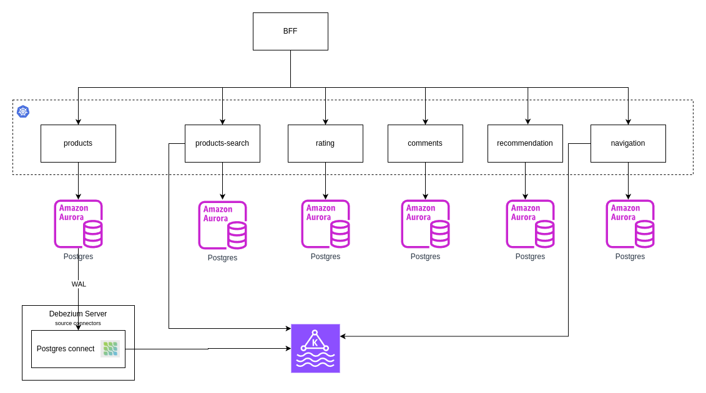

# Latency Afficionados

## 🏛️ Structure

### 1. 🎯 Problem Statement and Context

Latency Afficionados is a RETRO video game marketplace where
users can sell RETRO video games and users can also buy such video
games. 

The platform is capable of: 
- posting products
- search products
- view product descriptions
- rating products with review
- comments 
- provide recommendation of products to users based on previews browsing

Our CTO MR Fast want the smallest latencies possible. He cares deeply how things render and how fast they render. 

Right now the whole website is running on React 16. 

You need to find ways to speed up rendering and make sure rendering is fast all times. 

Mr Fast also has a monolith written in Java 1.4 which needs to be migrated to Java 21. 

You need to proposed a decomposition of the monolith.

### 2. 🎯 Goals

1. The application already exists, is needed to plan a migration to a new architecture.
2. Latency should be lower as possible.
3. Cloud-Native approach
4. Application should resilient in case of one component or AZ present failure

### 3. 🎯 Non-Goals

1. one-shoot migration, it usually create many problems, it is hard to rollback, long downtime for customers, and data migration risks/
2. on-premise approach
3. mobile application, it will focus on web application
4. multi-region disaster recovery

### 📐 3. Principles

1. User experience is our main drive. API should respond faster as possible and UI must render with less friction.
2. Low coupling: the components in the architecture should design to dependencies between each other. Design for event-driven architecture.
3. Observability: we need to monitor our APIs specially the response time, also we need to support distributed traces.
4. Scalability: this is a game marketplace so the application should be able to scale fast.

### 🏗️ 4. Overall Diagrams

wip

KeyPoints:

- Implementation of the Outbox Pattern to avoid dual-write issues
- Debezium to extract information from the database table
- Product-related events will be published to a Kafka topic
    - The topic will receive multiple product events (product created, product updated, product deleted). This design aims to eliminate any ordering issues
    - Avro for schema definition and versioning
    - Replication Factor = 3
    - Consumers must use manual acknowledgment (manual ack)
- Schema + Avro with multi-event support (https://www.confluent.io/blog/multiple-event-types-in-the-same-kafka-topic/)

Dataloss prevention on Debezium setup

- Debezium uses at-least-once: dont lose data but the publish duplicated
- In Postgres, **replication slots** track the position of consumers from WAL the LSN. Postgres ensure to not discard a segment from WAL until received the acknolodge from all consumers.
- This guaratee have a risk to the WAL grows until reachout out of disk
- Replication Slots should be removed in case of removing some debezium connector
- observability metrics needed:
    - Total Wal Size
    - Debezium LAG
    - Slot Replication Status
    - WAL retained per Replication Slot

links:
- https://www.morling.dev/blog/can-debezium-lose-events/
- https://www.morling.dev/blog/insatiable-postgres-replication-slot/
- https://engineering.zalando.com/posts/2023/11/patching-pgjdbc.html

### 🧭 5. Trade-offs

#### Major Decisions

1. The monolith should be decomposed into domain microservices (products, products-search, rating, comments, recommendation, navigation) 
2. The application should be able to scale fast to attemp spike to usage
3. Communication between services should be designed to avoid dataloss
4. Contract of events should be enforced in the publisher and consumers
5. Product search should fast (100ms) and should not affect or being affected by writes operations
6. The UX should be fluid avoiding/reducing the delay to show the complete page

#### Tradeoffs

**1. Microservices vs Modular Monolith**

PROS (+)
  * Independent scalability: service can scale up or scale down based on demand decreasing costs.
  * Fault isolation: if some component fails only a single service will be affected.
  * 

CONS (−)
  * Operational complexity: increase the complexity due the need of more CI/CD pipeline, more components running, more places to monitor.
  * Distributed-system failure modes: the architecture need to be prepare for new failure modes such as: partial failures, retries and eventual consistency .
  * Higher latency in cross-service flows: Flows that need to reach out multiple services tend to be slow.

**2. Kubernetes vs EC2**

PROS (+)
  * 

CONS (−)
  * 

**3. Event-Driven Architecture vs Request/Response Sync**

PROS (+)
  * 

CONS (−)
  * 

**4. Avro Schema vs Plain Text**

PROS (+)
  * 

CONS (−)
  * 

**5. CQRS vs Single-Database for read/write OPS**

PROS (+)
  * 

CONS (−)
  * 

**6. BFF vs Frontend calling multiple services**

PROS (+)
  * 

CONS (−)
  * 

### 🌏 6. For each key major component

wip

### 🖹 7. Migrations

wip

### 🖹 8. Testing strategy

wip 

### 🖹 9. Observability strategy

wip

### 🖹 10. Data Store Designs

wip 

### 🖹 11. Technology Stack

wip

### 🖹 12. References

* wip